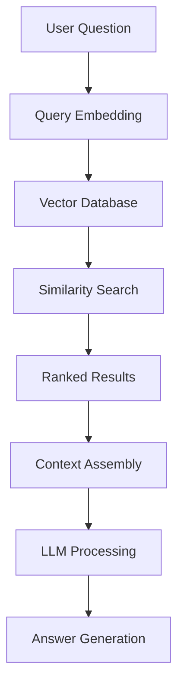

# Vector Search System

Tài liệu chi tiết về hệ thống vector search trong Chat Widget Q&A.

## 🎯 Tổng quan

Vector search là công nghệ cốt lõi cho phép tìm kiếm semantic trong knowledge base, giúp AI chatbot có thể trả lời câu hỏi chính xác dựa trên ngữ cảnh.

## 🏗️ Kiến trúc hệ thống



## 🔧 Implementation

### 1. Embedding Generation

#### OpenAI Embeddings
```typescript
@Injectable()
export class EmbeddingService {
  private readonly openai: OpenAI

  constructor() {
    this.openai = new OpenAI({
      apiKey: process.env.OPENAI_API_KEY,
    })
  }

  async generateEmbedding(text: string): Promise<number[]> {
    try {
      const response = await this.openai.embeddings.create({
        model: 'text-embedding-3-large',
        input: text,
        encoding_format: 'float'
      })

      return response.data[0].embedding
    } catch (error) {
      console.error(`[🔴] [EmbeddingService] [generateEmbedding] [error]:`, error)
      throw new Error('Failed to generate embedding')
    }
  }

  async generateBatchEmbeddings(texts: string[]): Promise<number[][]> {
    try {
      const response = await this.openai.embeddings.create({
        model: 'text-embedding-3-large',
        input: texts,
        encoding_format: 'float'
      })

      return response.data.map(item => item.embedding)
    } catch (error) {
      console.error(`[🔴] [EmbeddingService] [generateBatchEmbeddings] [error]:`, error)
      throw new Error('Failed to generate batch embeddings')
    }
  }
}
```

### 2. Vector Database Integration

#### Qdrant Integration
```typescript
@Injectable()
export class QdrantService {
  private readonly client: QdrantClient

  constructor() {
    this.client = new QdrantClient({
      url: process.env.QDRANT_URL,
      apiKey: process.env.QDRANT_API_KEY,
    })
  }

  async upsertVectors(
    vectors: Vector[], 
    collectionName: string = process.env.QDRANT_COLLECTION_NAME
  ): Promise<void> {
    try {
      const points = vectors.map(vector => ({
        id: vector.id,
        vector: vector.values,
        payload: vector.metadata
      }))

      await this.client.upsert(collectionName, {
        wait: true,
        points
      })
      
      console.log(`[✅] [QdrantService] [upsertVectors] [count]:`, vectors.length)
    } catch (error) {
      console.error(`[🔴] [QdrantService] [upsertVectors] [error]:`, error)
      throw error
    }
  }

  async queryVectors(
    queryVector: number[],
    collectionName: string = process.env.QDRANT_COLLECTION_NAME,
    topK: number = 5,
    filter?: Record<string, any>
  ): Promise<SearchResult[]> {
    try {
      const response = await this.client.search(collectionName, {
        vector: queryVector,
        limit: topK,
        with_payload: true,
        with_vector: false,
        filter: filter ? this.buildFilter(filter) : undefined
      })

      return response.map(result => ({
        id: result.id,
        score: result.score,
        content: result.payload.content,
        source: result.payload.source,
        url: result.payload.url,
        tokenSlug: result.payload.tokenSlug
      }))
    } catch (error) {
      console.error(`[🔴] [QdrantService] [queryVectors] [error]:`, error)
      throw error
    }
  }

  private buildFilter(filter: Record<string, any>): any {
    const conditions = Object.entries(filter).map(([key, value]) => ({
      key,
      match: { value }
    }))

    return {
      must: conditions
    }
  }

  async createCollection(
    collectionName: string = process.env.QDRANT_COLLECTION_NAME,
    vectorSize: number = 3072
  ): Promise<void> {
    try {
      await this.client.createCollection(collectionName, {
        vectors: {
          size: vectorSize,
          distance: 'Cosine'
        }
      })
      
      console.log(`[✅] [QdrantService] [createCollection] [name]:`, collectionName)
    } catch (error) {
      console.error(`[🔴] [QdrantService] [createCollection] [error]:`, error)
      throw error
    }
  }
}
```

### 3. Search Service

#### Hybrid Search Implementation
```typescript
@Injectable()
export class SearchService {
  constructor(
    private readonly embeddingService: EmbeddingService,
    private readonly pineconeService: PineconeService,
    private readonly keywordSearchService: KeywordSearchService
  ) {}

  async search(
    query: string,
    tokenSlug: string,
    options: SearchOptions = {}
  ): Promise<SearchResult[]> {
    try {
      const {
        topK = 5,
        useHybrid = true,
        minScore = 0.7,
        includeMetadata = true
      } = options

      let results: SearchResult[] = []

      if (useHybrid) {
        // Hybrid search: Vector + Keyword
        const [vectorResults, keywordResults] = await Promise.all([
          this.vectorSearch(query, tokenSlug, topK),
          this.keywordSearch(query, tokenSlug, topK)
        ])

        // Combine and rerank results
        results = this.combineAndRerank(vectorResults, keywordResults)
      } else {
        // Pure vector search
        results = await this.vectorSearch(query, tokenSlug, topK)
      }

      // Filter by minimum score
      results = results.filter(result => result.score >= minScore)

      return results
    } catch (error) {
      console.error(`[🔴] [SearchService] [search] [error]:`, error)
      throw error
    }
  }

  private async vectorSearch(
    query: string,
    tokenSlug: string,
    topK: number
  ): Promise<SearchResult[]> {
    const queryEmbedding = await this.embeddingService.generateEmbedding(query)
    
    const results = await this.qdrantService.queryVectors(
      queryEmbedding,
      process.env.QDRANT_COLLECTION_NAME,
      topK,
      { tokenSlug }
    )

    return results.map(result => ({
      id: result.id,
      content: result.content,
      source: result.source,
      url: result.url,
      score: result.score,
      type: 'vector'
    }))
  }

  private async keywordSearch(
    query: string,
    tokenSlug: string,
    topK: number
  ): Promise<SearchResult[]> {
    return this.keywordSearchService.search(query, tokenSlug, topK)
  }

  private combineAndRerank(
    vectorResults: SearchResult[],
    keywordResults: SearchResult[]
  ): SearchResult[] {
    // Combine results and remove duplicates
    const combined = new Map<string, SearchResult>()
    
    // Add vector results with higher weight
    vectorResults.forEach(result => {
      combined.set(result.id, { ...result, score: result.score * 0.7 })
    })
    
    // Add keyword results
    keywordResults.forEach(result => {
      const existing = combined.get(result.id)
      if (existing) {
        // Boost score if found in both
        existing.score = Math.max(existing.score, result.score * 0.3)
      } else {
        combined.set(result.id, { ...result, score: result.score * 0.3 })
      }
    })

    // Sort by score and return top results
    return Array.from(combined.values())
      .sort((a, b) => b.score - a.score)
      .slice(0, Math.max(vectorResults.length, keywordResults.length))
  }

  private async prepareVectorsForQdrant(
    chunks: Chunk[],
    tokenSlug: string
  ): Promise<Vector[]> {
    const vectors: Vector[] = []
    
    for (const chunk of chunks) {
      try {
        const embedding = await this.embeddingService.generateEmbedding(chunk.content)
        
        vectors.push({
          id: `${tokenSlug}_${chunk.id}`,
          values: embedding,
          metadata: {
            content: chunk.content,
            source: chunk.source,
            tokenSlug,
            type: chunk.type,
            url: chunk.url
          }
        })
      } catch (error) {
        console.error(`[🔴] [SearchService] [prepareVectorsForQdrant] [chunk ${chunk.id}]:`, error)
      }
    }
    
    return vectors
  }
}
```

## 📊 Performance Optimization

### 1. Caching Strategy

#### Redis Cache for Embeddings
```typescript
@Injectable()
export class EmbeddingCacheService {
  constructor(
    private readonly redis: Redis,
    private readonly embeddingService: EmbeddingService
  ) {}

  async getEmbedding(text: string): Promise<number[]> {
    const cacheKey = `embedding:${this.hashText(text)}`
    
    // Try to get from cache
    const cached = await this.redis.get(cacheKey)
    if (cached) {
      return JSON.parse(cached)
    }

    // Generate new embedding
    const embedding = await this.embeddingService.generateEmbedding(text)
    
    // Cache for 24 hours
    await this.redis.setex(cacheKey, 86400, JSON.stringify(embedding))
    
    return embedding
  }

  private hashText(text: string): string {
    return crypto.createHash('sha256').update(text).digest('hex')
  }
}
```

### 2. Batch Processing

#### Batch Embedding Generation
```typescript
@Injectable()
export class BatchEmbeddingService {
  async processBatch(
    texts: string[],
    batchSize: number = 100
  ): Promise<number[][]> {
    const results: number[][] = []
    
    for (let i = 0; i < texts.length; i += batchSize) {
      const batch = texts.slice(i, i + batchSize)
      
      try {
        const embeddings = await this.embeddingService.generateBatchEmbeddings(batch)
        results.push(...embeddings)
        
        // Rate limiting
        await this.delay(100)
      } catch (error) {
        console.error(`[🔴] [BatchEmbeddingService] [processBatch] [batch ${i}]:`, error)
        // Continue with next batch
      }
    }
    
    return results
  }

  private delay(ms: number): Promise<void> {
    return new Promise(resolve => setTimeout(resolve, ms))
  }
}
```

## 🎯 Search Quality

### 1. Query Preprocessing

#### Query Enhancement
```typescript
@Injectable()
export class QueryPreprocessor {
  async preprocessQuery(query: string, tokenSlug: string): Promise<string> {
    // 1. Clean and normalize
    let processedQuery = query.trim().toLowerCase()
    
    // 2. Add token context
    processedQuery = `${processedQuery} ${tokenSlug} token cryptocurrency`
    
    // 3. Expand abbreviations
    processedQuery = this.expandAbbreviations(processedQuery)
    
    // 4. Add synonyms
    processedQuery = this.addSynonyms(processedQuery)
    
    return processedQuery
  }

  private expandAbbreviations(query: string): string {
    const abbreviations = {
      'defi': 'decentralized finance',
      'dao': 'decentralized autonomous organization',
      'nft': 'non-fungible token',
      'dapp': 'decentralized application'
    }
    
    let expanded = query
    Object.entries(abbreviations).forEach(([abbr, full]) => {
      expanded = expanded.replace(new RegExp(`\\b${abbr}\\b`, 'gi'), `${abbr} ${full}`)
    })
    
    return expanded
  }

  private addSynonyms(query: string): string {
    const synonyms = {
      'price': 'cost value',
      'token': 'coin cryptocurrency',
      'project': 'protocol platform',
      'invest': 'buy purchase'
    }
    
    let enhanced = query
    Object.entries(synonyms).forEach(([word, synonyms]) => {
      enhanced = enhanced.replace(new RegExp(`\\b${word}\\b`, 'gi'), `${word} ${synonyms}`)
    })
    
    return enhanced
  }
}
```

### 2. Result Ranking

#### Advanced Reranking
```typescript
@Injectable()
export class RerankingService {
  async rerankResults(
    results: SearchResult[],
    query: string,
    tokenSlug: string
  ): Promise<SearchResult[]> {
    return results.map(result => ({
      ...result,
      score: this.calculateRelevanceScore(result, query, tokenSlug)
    })).sort((a, b) => b.score - a.score)
  }

  private calculateRelevanceScore(
    result: SearchResult,
    query: string,
    tokenSlug: string
  ): number {
    let score = result.score

    // Boost score for exact token match
    if (result.content.toLowerCase().includes(tokenSlug.toLowerCase())) {
      score *= 1.2
    }

    // Boost score for recent content
    if (result.metadata?.timestamp) {
      const age = Date.now() - new Date(result.metadata.timestamp).getTime()
      const daysOld = age / (1000 * 60 * 60 * 24)
      if (daysOld < 30) score *= 1.1
    }

    // Boost score for official sources
    if (result.source === 'official_docs') {
      score *= 1.3
    }

    // Penalize very short results
    if (result.content.length < 50) {
      score *= 0.8
    }

    return Math.min(score, 1.0) // Cap at 1.0
  }
}
```

## 📈 Monitoring & Analytics

### 1. Search Metrics

#### Performance Tracking
```typescript
@Injectable()
export class SearchMetricsService {
  async trackSearch(
    query: string,
    tokenSlug: string,
    results: SearchResult[],
    responseTime: number
  ): Promise<void> {
    const metrics = {
      query: query.substring(0, 100), // Truncate for privacy
      tokenSlug,
      resultCount: results.length,
      avgScore: results.reduce((sum, r) => sum + r.score, 0) / results.length,
      responseTime,
      timestamp: new Date().toISOString()
    }

    // Store in database
    await this.metricsRepository.save(metrics)

    // Send to analytics
    await this.analyticsService.track('search_performed', metrics)
  }
}
```

### 2. Quality Assessment

#### Search Quality Metrics
```typescript
@Injectable()
export class SearchQualityService {
  async assessQuality(
    query: string,
    results: SearchResult[],
    userFeedback?: 'helpful' | 'not_helpful'
  ): Promise<QualityMetrics> {
    const metrics: QualityMetrics = {
      queryLength: query.length,
      resultCount: results.length,
      avgRelevanceScore: results.reduce((sum, r) => sum + r.score, 0) / results.length,
      hasOfficialSources: results.some(r => r.source === 'official_docs'),
      diversityScore: this.calculateDiversityScore(results),
      userFeedback
    }

    return metrics
  }

  private calculateDiversityScore(results: SearchResult[]): number {
    const sources = new Set(results.map(r => r.source))
    return sources.size / results.length
  }
}
```

## 🚀 Best Practices

### 1. Index Management
- Sử dụng namespace riêng cho mỗi token
- Implement index rotation cho data mới
- Monitor index size và performance

### 2. Query Optimization
- Cache frequent queries
- Preprocess queries để tăng relevance
- Sử dụng hybrid search cho kết quả tốt nhất

### 3. Error Handling
- Implement fallback mechanisms
- Retry failed requests
- Log errors cho debugging

### 4. Security
- Validate input queries
- Sanitize search results
- Rate limit search requests

---

**AI System Team** - Agent PRTGE

*Last updated: [Current Date]*
