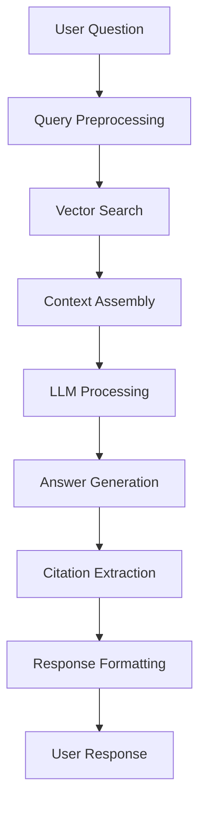

# AI Processing System

Tài liệu chi tiết về hệ thống AI processing trong Chat Widget Q&A.

## 🎯 Tổng quan

Hệ thống AI processing xử lý câu hỏi từ người dùng, tìm kiếm thông tin liên quan, và tạo ra câu trả lời chính xác dựa trên knowledge base.

## 🏗️ Kiến trúc hệ thống



## 🔧 Core Components

### 1. Chat Controller

#### REST API Endpoint
```typescript
@Controller('chat')
@ApiTags('Chat')
export class ChatController {
  constructor(
    private readonly chatService: ChatService,
    private readonly validationService: ValidationService
  ) {}

  @Post()
  @ApiOperation({
    summary: 'Process chat message',
    description: 'Process user question and return AI-generated answer'
  })
  @ApiBody({ type: ChatRequestDto })
  @ApiResponse({
    status: HttpStatus.OK,
    description: 'Answer generated successfully',
    type: ChatResponseDto
  })
  async processMessage(@Body() request: ChatRequestDto): Promise<ChatResponseDto> {
    try {
      // Validate request
      await this.validationService.validateChatRequest(request)
      
      // Process chat message
      const response = await this.chatService.processMessage(request)
      
      return response
    } catch (error) {
      console.error(`[🔴] [ChatController] [processMessage] [error]:`, error)
      throw new HttpException(
        'Failed to process chat message',
        HttpStatus.INTERNAL_SERVER_ERROR
      )
    }
  }
}
```

### 2. Chat Service

#### Main Processing Logic
```typescript
@Injectable()
export class ChatService {
  constructor(
    private readonly searchService: SearchService,
    private readonly llmService: LLMService,
    private readonly citationService: CitationService,
    private readonly contextService: ContextService
  ) {}

  async processMessage(request: ChatRequestDto): Promise<ChatResponseDto> {
    try {
      console.log(`[🔄] [ChatService] [processMessage] [request]:`, {
        tokenSlug: request.tokenSlug,
        questionLength: request.question.length,
        sessionId: request.sessionId
      })

      // 1. Get chat history for context
      const chatHistory = await this.getChatHistory(
        request.sessionId || request.tokenSlug,
        request.tokenSlug
      )

      // 2. Search for relevant context
      const searchResults = await this.searchService.search(
        request.question,
        request.tokenSlug,
        {
          topK: 5,
          minScore: 0.7,
          useHybrid: true
        }
      )

      if (searchResults.length === 0) {
        return this.createNoContextResponse(request.question)
      }

      // 3. Assemble context with chat history
      const context = await this.contextService.assembleContext(
        searchResults,
        request.question,
        chatHistory
      )

      // 4. Generate answer using LLM with chat history
      const answer = await this.llmService.generateAnswer(
        request.question,
        context,
        request.language || 'en',
        chatHistory
      )

      // 5. Extract citations
      const citations = await this.citationService.extractCitations(
        searchResults,
        answer
      )

      // 6. Save message to chat history
      await this.saveChatMessage({
        sessionId: request.sessionId || request.tokenSlug,
        tokenSlug: request.tokenSlug,
        question: request.question,
        answer,
        citations,
        timestamp: new Date()
      })

      // 7. Format response
      const response: ChatResponseDto = {
        answer,
        citations,
        confidence: this.calculateConfidence(searchResults, answer),
        sources: searchResults.map(r => r.source),
        sessionId: request.sessionId || request.tokenSlug,
        timestamp: new Date().toISOString()
      }

      console.log(`[✅] [ChatService] [processMessage] [success]`)
      return response

    } catch (error) {
      console.error(`[🔴] [ChatService] [processMessage] [error]:`, error)
      throw error
    }
  }

  private createNoContextResponse(question: string): ChatResponseDto {
    return {
      answer: "I don't have enough information about this topic to provide a reliable answer. Please try asking about a different aspect of the project.",
      citations: [],
      confidence: 0.1,
      sources: [],
      timestamp: new Date().toISOString()
    }
  }

  private calculateConfidence(
    searchResults: SearchResult[],
    answer: string
  ): number {
    const avgScore = searchResults.reduce((sum, r) => sum + r.score, 0) / searchResults.length
    const answerLength = answer.length
    const hasCitations = searchResults.length > 0

    let confidence = avgScore * 0.7
    if (answerLength > 100) confidence += 0.1
    if (hasCitations) confidence += 0.2

    return Math.min(confidence, 1.0)
  }

  // Chat History Methods
  private async getChatHistory(
    sessionId: string,
    tokenSlug: string,
    limit: number = 10
  ): Promise<ChatMessage[]> {
    try {
      const history = await this.chatHistoryRepository.find({
        where: { sessionId, tokenSlug },
        order: { timestamp: 'DESC' },
        take: limit
      })

      return history.reverse() // Return in chronological order
    } catch (error) {
      console.error(`[🔴] [ChatService] [getChatHistory] [error]:`, error)
      return []
    }
  }

  private async saveChatMessage(message: {
    sessionId: string
    tokenSlug: string
    question: string
    answer: string
    citations: Citation[]
    timestamp: Date
  }): Promise<void> {
    try {
      await this.chatHistoryRepository.save({
        sessionId: message.sessionId,
        tokenSlug: message.tokenSlug,
        question: message.question,
        answer: message.answer,
        citations: JSON.stringify(message.citations),
        timestamp: message.timestamp
      })

      console.log(`[✅] [ChatService] [saveChatMessage] [sessionId]:`, message.sessionId)
    } catch (error) {
      console.error(`[🔴] [ChatService] [saveChatMessage] [error]:`, error)
    }
  }

  async clearChatHistory(sessionId: string, tokenSlug: string): Promise<void> {
    try {
      await this.chatHistoryRepository.delete({
        sessionId,
        tokenSlug
      })

      console.log(`[✅] [ChatService] [clearChatHistory] [sessionId]:`, sessionId)
    } catch (error) {
      console.error(`[🔴] [ChatService] [clearChatHistory] [error]:`, error)
      throw error
    }
  }
}
```

### 3. LLM Service

#### OpenAI Integration
```typescript
@Injectable()
export class LLMService {
  private readonly openai: OpenAI

  constructor() {
    this.openai = new OpenAI({
      apiKey: process.env.OPENAI_API_KEY,
    })
  }

  async generateAnswer(
    question: string,
    context: string,
    language: string = 'en',
    chatHistory: ChatMessage[] = []
  ): Promise<string> {
    try {
      const systemPrompt = this.buildSystemPrompt(language)
      
      // Build messages array with chat history
      const messages: any[] = [
        { role: 'system', content: systemPrompt }
      ]

      // Add chat history (last 5 messages to avoid token limit)
      const recentHistory = chatHistory.slice(-5)
      for (const msg of recentHistory) {
        messages.push({ role: 'user', content: msg.question })
        messages.push({ role: 'assistant', content: msg.answer })
      }

      // Add current context and question
      messages.push({
        role: 'user',
        content: `Context: ${context}\n\nQuestion: ${question}`
      })

      const completion = await this.openai.chat.completions.create({
        model: 'gpt-4',
        messages,
        max_tokens: 1000,
        temperature: 0.7,
        top_p: 0.9
      })

      const answer = completion.choices[0].message.content
      
      console.log(`[✅] [LLMService] [generateAnswer] [success] [historyCount]:`, recentHistory.length)
      return answer

    } catch (error) {
      console.error(`[🔴] [LLMService] [generateAnswer] [error]:`, error)
      throw new Error('Failed to generate answer')
    }
  }

  private buildSystemPrompt(language: string): string {
    const prompts = {
      en: `You are a helpful AI assistant specialized in cryptocurrency and blockchain projects. 
           Answer questions based ONLY on the provided context. 
           Be accurate, concise, and helpful. 
           If you're unsure, say so. 
           Always cite sources when possible.`,
      
      vi: `Bạn là trợ lý AI chuyên về tiền điện tử và dự án blockchain. 
           Trả lời câu hỏi CHỈ dựa trên thông tin được cung cấp. 
           Hãy chính xác, súc tích và hữu ích. 
           Nếu không chắc chắn, hãy nói rõ. 
           Luôn trích dẫn nguồn khi có thể.`
    }

    return prompts[language] || prompts.en
  }
}
```

### 4. Context Service

#### Context Assembly
```typescript
@Injectable()
export class ContextService {
  async assembleContext(
    searchResults: SearchResult[],
    question: string,
    chatHistory: ChatMessage[] = []
  ): Promise<string> {
    try {
      // Group results by source
      const groupedResults = this.groupBySource(searchResults)
      
      // Build context sections
      const contextSections: string[] = []
      
      // Add chat history context if available
      if (chatHistory.length > 0) {
        const historyContext = this.buildHistoryContext(chatHistory)
        contextSections.push(`Previous Conversation:\n${historyContext}`)
      }
      
      // Add token basic info
      const tokenInfo = groupedResults.get('token_info')
      if (tokenInfo) {
        contextSections.push(`Token Information:\n${tokenInfo.map(r => r.content).join('\n')}`)
      }
      
      // Add project description
      const description = groupedResults.get('description')
      if (description) {
        contextSections.push(`Project Description:\n${description.map(r => r.content).join('\n')}`)
      }
      
      // Add tokenomics
      const tokenomics = groupedResults.get('tokenomics')
      if (tokenomics) {
        contextSections.push(`Tokenomics:\n${tokenomics.map(r => r.content).join('\n')}`)
      }
      
      // Add other relevant information
      const other = searchResults.filter(r => 
        !['token_info', 'description', 'tokenomics'].includes(r.source)
      )
      if (other.length > 0) {
        contextSections.push(`Additional Information:\n${other.map(r => r.content).join('\n')}`)
      }
      
      const context = contextSections.join('\n\n')
      
      console.log(`[✅] [ContextService] [assembleContext] [sections]:`, contextSections.length)
      return context

    } catch (error) {
      console.error(`[🔴] [ContextService] [assembleContext] [error]:`, error)
      throw error
    }
  }

  private buildHistoryContext(chatHistory: ChatMessage[]): string {
    // Build a concise summary of recent conversation
    const recentHistory = chatHistory.slice(-3) // Last 3 exchanges
    
    return recentHistory.map((msg, index) => 
      `Q${index + 1}: ${msg.question}\nA${index + 1}: ${msg.answer.substring(0, 200)}...`
    ).join('\n\n')
  }

  private groupBySource(results: SearchResult[]): Map<string, SearchResult[]> {
    const grouped = new Map<string, SearchResult[]>()
    
    results.forEach(result => {
      const source = result.source
      if (!grouped.has(source)) {
        grouped.set(source, [])
      }
      grouped.get(source)!.push(result)
    })
    
    return grouped
  }
}
```

### 5. Citation Service

#### Citation Extraction
```typescript
@Injectable()
export class CitationService {
  async extractCitations(
    searchResults: SearchResult[],
    answer: string
  ): Promise<Citation[]> {
    try {
      const citations: Citation[] = []
      
      // Extract citations from search results
      searchResults.forEach((result, index) => {
        const citation: Citation = {
          id: `citation_${index + 1}`,
          title: this.extractTitle(result.content),
          url: result.url,
          source: result.source,
          relevanceScore: result.score,
          snippet: this.extractSnippet(result.content, 200)
        }
        
        citations.push(citation)
      })
      
      // Sort by relevance
      citations.sort((a, b) => b.relevanceScore - a.relevanceScore)
      
      console.log(`[✅] [CitationService] [extractCitations] [count]:`, citations.length)
      return citations

    } catch (error) {
      console.error(`[🔴] [CitationService] [extractCitations] [error]:`, error)
      throw error
    }
  }

  private extractTitle(content: string): string {
    const lines = content.split('\n')
    const firstLine = lines[0].trim()
    
    if (firstLine.length > 60) {
      return firstLine.substring(0, 60) + '...'
    }
    
    return firstLine || 'Untitled'
  }

  private extractSnippet(content: string, maxLength: number): string {
    const cleanContent = content.replace(/\n+/g, ' ').trim()
    
    if (cleanContent.length <= maxLength) {
      return cleanContent
    }
    
    return cleanContent.substring(0, maxLength) + '...'
  }
}
```

## 📚 Chat History Management

### 1. Chat History Entity

#### Database Entity
```typescript
@Entity('chat_history')
export class ChatHistoryEntity extends BaseEntity {
  @PrimaryGeneratedColumn('uuid')
  id: string

  @Column()
  sessionId: string

  @Column()
  tokenSlug: string

  @Column('text')
  question: string

  @Column('text')
  answer: string

  @Column('json', { nullable: true })
  citations: string

  @CreateDateColumn()
  timestamp: Date

  @Column({ nullable: true })
  userId: string

  @Column({ default: 'en' })
  language: string
}
```

### 2. Chat History Repository

#### Repository Implementation
```typescript
@Injectable()
export class ChatHistoryRepository {
  constructor(
    @InjectRepository(ChatHistoryEntity)
    private readonly repository: Repository<ChatHistoryEntity>
  ) {}

  async find({
    sessionId,
    tokenSlug,
    limit = 10,
    offset = 0
  }: {
    sessionId: string
    tokenSlug: string
    limit?: number
    offset?: number
  }): Promise<ChatHistoryEntity[]> {
    return this.repository.find({
      where: { sessionId, tokenSlug },
      order: { timestamp: 'DESC' },
      take: limit,
      skip: offset
    })
  }

  async save(message: {
    sessionId: string
    tokenSlug: string
    question: string
    answer: string
    citations: string
    userId?: string
    language?: string
  }): Promise<ChatHistoryEntity> {
    const entity = this.repository.create({
      sessionId: message.sessionId,
      tokenSlug: message.tokenSlug,
      question: message.question,
      answer: message.answer,
      citations: message.citations,
      userId: message.userId,
      language: message.language || 'en'
    })

    return this.repository.save(entity)
  }

  async delete({
    sessionId,
    tokenSlug
  }: {
    sessionId: string
    tokenSlug: string
  }): Promise<void> {
    await this.repository.delete({ sessionId, tokenSlug })
  }

  async getSessionStats(sessionId: string): Promise<{
    totalMessages: number
    uniqueTokens: string[]
    lastActivity: Date
  }> {
    const messages = await this.repository.find({
      where: { sessionId },
      order: { timestamp: 'DESC' }
    })

    const uniqueTokens = [...new Set(messages.map(m => m.tokenSlug))]
    const lastActivity = messages[0]?.timestamp || new Date()

    return {
      totalMessages: messages.length,
      uniqueTokens,
      lastActivity
    }
  }
}
```

### 3. Chat History API Endpoints

#### REST Endpoints
```typescript
@Controller('chat-history')
@ApiTags('Chat History')
export class ChatHistoryController {
  constructor(
    private readonly chatHistoryService: ChatHistoryService
  ) {}

  @Get(':sessionId')
  @ApiOperation({
    summary: 'Get chat history',
    description: 'Retrieve chat history for a session'
  })
  @ApiParam({ name: 'sessionId', description: 'Session ID' })
  @ApiQuery({ name: 'tokenSlug', required: false, description: 'Filter by token slug' })
  @ApiQuery({ name: 'limit', required: false, description: 'Number of messages to return' })
  async getChatHistory(
    @Param('sessionId') sessionId: string,
    @Query('tokenSlug') tokenSlug?: string,
    @Query('limit') limit: number = 20
  ): Promise<ChatHistoryResponseDto> {
    return this.chatHistoryService.getHistory(sessionId, tokenSlug, limit)
  }

  @Delete(':sessionId')
  @ApiOperation({
    summary: 'Clear chat history',
    description: 'Clear all chat history for a session'
  })
  @ApiParam({ name: 'sessionId', description: 'Session ID' })
  async clearChatHistory(
    @Param('sessionId') sessionId: string,
    @Query('tokenSlug') tokenSlug?: string
  ): Promise<{ message: string }> {
    await this.chatHistoryService.clearHistory(sessionId, tokenSlug)
    return { message: 'Chat history cleared successfully' }
  }

  @Get(':sessionId/stats')
  @ApiOperation({
    summary: 'Get session statistics',
    description: 'Get statistics for a chat session'
  })
  @ApiParam({ name: 'sessionId', description: 'Session ID' })
  async getSessionStats(
    @Param('sessionId') sessionId: string
  ): Promise<SessionStatsDto> {
    return this.chatHistoryService.getSessionStats(sessionId)
  }
}
```

## 🔄 Streaming API Integration

### Real-time Chat với Streaming
```typescript
@Controller('chat')
@ApiTags('Chat')
export class ChatController {
  constructor(
    private readonly chatService: ChatService
  ) {}

  @Post('stream')
  @ApiOperation({
    summary: 'Stream chat response',
    description: 'Stream AI response in real-time'
  })
  @ApiBody({ type: ChatRequestDto })
  async streamChat(
    @Body() request: ChatRequestDto,
    @Res() res: Response
  ): Promise<void> {
    try {
      // Set headers for streaming
      res.setHeader('Content-Type', 'text/plain; charset=utf-8')
      res.setHeader('Cache-Control', 'no-cache')
      res.setHeader('Connection', 'keep-alive')
      res.setHeader('Access-Control-Allow-Origin', '*')

      // Stream response
      await this.chatService.streamResponse(request, res)
      
    } catch (error) {
      console.error(`[🔴] [ChatController] [streamChat] [error]:`, error)
      res.status(500).json({ error: 'Failed to stream response' })
    }
  }
}
```

### Streaming Service Implementation
```typescript
@Injectable()
export class ChatService {
  async streamResponse(
    request: ChatRequestDto,
    res: Response
  ): Promise<void> {
    try {
      console.log(`[🔄] [ChatService] [streamResponse] [request]:`, {
        tokenSlug: request.tokenSlug,
        questionLength: request.question.length
      })

      // 1. Search for relevant context
      const searchResults = await this.searchService.search(
        request.question,
        request.tokenSlug,
        { topK: 5, minScore: 0.7 }
      )

      if (searchResults.length === 0) {
        res.write('data: {"type":"error","message":"No relevant information found"}\n\n')
        res.end()
        return
      }

      // 2. Assemble context
      const context = await this.contextService.assembleContext(
        searchResults,
        request.question
      )

      // 3. Stream answer using OpenAI streaming
      await this.streamLLMResponse(
        request.question,
        context,
        request.language || 'en',
        res
      )

      // 4. Send citations
      const citations = await this.citationService.extractCitations(
        searchResults,
        ''
      )

      res.write(`data: {"type":"citations","data":${JSON.stringify(citations)}}\n\n`)
      res.write('data: {"type":"done"}\n\n')
      res.end()

      console.log(`[✅] [ChatService] [streamResponse] [success]`)

    } catch (error) {
      console.error(`[🔴] [ChatService] [streamResponse] [error]:`, error)
      res.write(`data: {"type":"error","message":"${error.message}"}\n\n`)
      res.end()
    }
  }

  private async streamLLMResponse(
    question: string,
    context: string,
    language: string,
    res: Response
  ): Promise<void> {
    try {
      const systemPrompt = this.buildSystemPrompt(language)
      
      const stream = await this.openai.chat.completions.create({
        model: 'gpt-4',
        messages: [
          { role: 'system', content: systemPrompt },
          { role: 'user', content: `Context: ${context}\n\nQuestion: ${question}` }
        ],
        stream: true,
        max_tokens: 1000,
        temperature: 0.7
      })

      for await (const chunk of stream) {
        const content = chunk.choices[0]?.delta?.content
        if (content) {
          res.write(`data: {"type":"content","data":"${content}"}\n\n`)
        }
      }

    } catch (error) {
      console.error(`[🔴] [ChatService] [streamLLMResponse] [error]:`, error)
      throw error
    }
  }
}
```

## 📊 Performance Optimization

### 1. Caching Strategy

#### Response Caching
```typescript
@Injectable()
export class ChatCacheService {
  constructor(
    private readonly redis: Redis
  ) {}

  async getCachedResponse(
    question: string,
    tokenSlug: string
  ): Promise<ChatResponseDto | null> {
    try {
      const cacheKey = `chat:${tokenSlug}:${this.hashQuestion(question)}`
      const cached = await this.redis.get(cacheKey)
      
      if (cached) {
        return JSON.parse(cached)
      }
      
      return null
    } catch (error) {
      console.error(`[🔴] [ChatCacheService] [getCachedResponse] [error]:`, error)
      return null
    }
  }

  async setCachedResponse(
    question: string,
    tokenSlug: string,
    response: ChatResponseDto,
    ttl: number = 3600
  ): Promise<void> {
    try {
      const cacheKey = `chat:${tokenSlug}:${this.hashQuestion(question)}`
      await this.redis.setex(cacheKey, ttl, JSON.stringify(response))
    } catch (error) {
      console.error(`[🔴] [ChatCacheService] [setCachedResponse] [error]:`, error)
    }
  }

  private hashQuestion(question: string): string {
    return crypto.createHash('md5').update(question.toLowerCase()).digest('hex')
  }
}
```

### 2. Rate Limiting

#### Request Rate Limiting
```typescript
@Injectable()
export class ChatRateLimitService {
  constructor(
    private readonly redis: Redis
  ) {}

  async checkRateLimit(
    clientId: string,
    tokenSlug: string
  ): Promise<{ allowed: boolean; remaining: number }> {
    try {
      const key = `rate_limit:${clientId}:${tokenSlug}`
      const current = await this.redis.incr(key)
      
      if (current === 1) {
        await this.redis.expire(key, 60) // 1 minute window
      }
      
      const limit = 10 // 10 requests per minute
      const remaining = Math.max(0, limit - current)
      
      return {
        allowed: current <= limit,
        remaining
      }
    } catch (error) {
      console.error(`[🔴] [ChatRateLimitService] [checkRateLimit] [error]:`, error)
      return { allowed: true, remaining: 10 }
    }
  }
}
```

## 🎯 Quality Assurance

### 1. Response Validation

#### Answer Quality Check
```typescript
@Injectable()
export class ResponseValidationService {
  async validateResponse(
    question: string,
    answer: string,
    citations: Citation[]
  ): Promise<ValidationResult> {
    const issues: string[] = []
    
    // Check answer length
    if (answer.length < 20) {
      issues.push('Answer too short')
    }
    
    if (answer.length > 2000) {
      issues.push('Answer too long')
    }
    
    // Check for hallucinations
    if (this.containsHallucinations(answer)) {
      issues.push('Potential hallucination detected')
    }
    
    // Check citation quality
    if (citations.length === 0) {
      issues.push('No citations provided')
    }
    
    // Check answer relevance
    const relevanceScore = this.calculateRelevance(question, answer)
    if (relevanceScore < 0.5) {
      issues.push('Low relevance score')
    }
    
    return {
      isValid: issues.length === 0,
      issues,
      relevanceScore
    }
  }

  private containsHallucinations(answer: string): boolean {
    const hallucinationIndicators = [
      'I cannot provide specific information',
      'I don\'t have access to',
      'I cannot verify',
      'I am not able to'
    ]
    
    return hallucinationIndicators.some(indicator => 
      answer.toLowerCase().includes(indicator.toLowerCase())
    )
  }

  private calculateRelevance(question: string, answer: string): number {
    // Simple keyword matching for relevance
    const questionWords = question.toLowerCase().split(/\s+/)
    const answerWords = answer.toLowerCase().split(/\s+/)
    
    const commonWords = questionWords.filter(word => 
      answerWords.includes(word) && word.length > 3
    )
    
    return commonWords.length / questionWords.length
  }
}
```

## 📈 Monitoring & Analytics

### 1. Performance Metrics

#### Chat Metrics Tracking
```typescript
@Injectable()
export class ChatMetricsService {
  async trackChatMetrics(
    request: ChatRequestDto,
    response: ChatResponseDto,
    processingTime: number
  ): Promise<void> {
    const metrics = {
      tokenSlug: request.tokenSlug,
      questionLength: request.question.length,
      answerLength: response.answer.length,
      citationCount: response.citations.length,
      confidence: response.confidence,
      processingTime,
      timestamp: new Date().toISOString()
    }
    
    // Store in database
    await this.metricsRepository.save(metrics)
    
    // Send to analytics
    await this.analyticsService.track('chat_processed', metrics)
  }
}
```

---

**AI Processing Team** - Agent PRTGE

*Last updated: [Current Date]*
