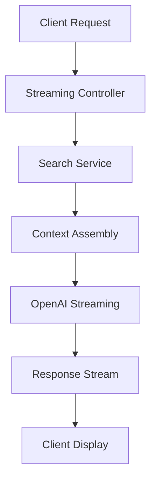

# Streaming API Guide

Hướng dẫn chi tiết về Streaming API cho real-time chat trong Chat Widget Q&A.

## 🎯 Tổng quan

Streaming API cho phép trả lời chat real-time bằng cách stream dữ liệu từ server đến client, tạo trải nghiệm chat mượt mà và responsive.

## 🏗️ Kiến trúc Streaming



## 🔧 Implementation

### 1. Streaming Controller

#### REST Endpoint
```typescript
@Controller('chat')
@ApiTags('Chat')
export class ChatController {
  constructor(
    private readonly chatService: ChatService
  ) {}

  @Post('stream')
  @ApiOperation({
    summary: 'Stream chat response',
    description: 'Stream AI response in real-time using Server-Sent Events'
  })
  @ApiBody({ type: ChatRequestDto })
  @ApiResponse({
    status: HttpStatus.OK,
    description: 'Streaming response started',
    type: 'text/event-stream'
  })
  async streamChat(
    @Body() request: ChatRequestDto,
    @Res() res: Response
  ): Promise<void> {
    try {
      // Set SSE headers
      res.setHeader('Content-Type', 'text/event-stream')
      res.setHeader('Cache-Control', 'no-cache')
      res.setHeader('Connection', 'keep-alive')
      res.setHeader('Access-Control-Allow-Origin', '*')
      res.setHeader('Access-Control-Allow-Headers', 'Cache-Control')

      // Start streaming
      await this.chatService.streamResponse(request, res)
      
    } catch (error) {
      console.error(`[🔴] [ChatController] [streamChat] [error]:`, error)
      res.write(`data: ${JSON.stringify({ type: 'error', message: error.message })}\n\n`)
      res.end()
    }
  }
}
```

### 2. Streaming Service

#### Main Streaming Logic
```typescript
@Injectable()
export class ChatService {
  constructor(
    private readonly searchService: SearchService,
    private readonly contextService: ContextService,
    private readonly openaiService: OpenAIService,
    private readonly citationService: CitationService
  ) {}

  async streamResponse(
    request: ChatRequestDto,
    res: Response
  ): Promise<void> {
    try {
      console.log(`[🔄] [ChatService] [streamResponse] [request]:`, {
        tokenSlug: request.tokenSlug,
        questionLength: request.question.length
      })

      // Send initial status
      this.writeSSE(res, { type: 'status', message: 'Searching for relevant information...' })

      // 1. Search for relevant context
      const searchResults = await this.searchService.search(
        request.question,
        request.tokenSlug,
        { topK: 5, minScore: 0.7, useHybrid: true }
      )

      if (searchResults.length === 0) {
        this.writeSSE(res, { 
          type: 'error', 
          message: 'No relevant information found for this question.' 
        })
        this.writeSSE(res, { type: 'done' })
        res.end()
        return
      }

      // Send search results status
      this.writeSSE(res, { 
        type: 'status', 
        message: `Found ${searchResults.length} relevant sources. Generating answer...` 
      })

      // 2. Assemble context
      const context = await this.contextService.assembleContext(
        searchResults,
        request.question
      )

      // 3. Stream LLM response
      await this.streamLLMResponse(
        request.question,
        context,
        request.language || 'en',
        res
      )

      // 4. Send citations
      const citations = await this.citationService.extractCitations(
        searchResults,
        ''
      )

      this.writeSSE(res, { type: 'citations', data: citations })
      this.writeSSE(res, { type: 'done' })
      res.end()

      console.log(`[✅] [ChatService] [streamResponse] [success]`)

    } catch (error) {
      console.error(`[🔴] [ChatService] [streamResponse] [error]:`, error)
      this.writeSSE(res, { type: 'error', message: error.message })
      this.writeSSE(res, { type: 'done' })
      res.end()
    }
  }

  private writeSSE(res: Response, data: any): void {
    res.write(`data: ${JSON.stringify(data)}\n\n`)
  }

  private async streamLLMResponse(
    question: string,
    context: string,
    language: string,
    res: Response
  ): Promise<void> {
    try {
      const systemPrompt = this.buildSystemPrompt(language)
      
      const stream = await this.openaiService.createStream({
        model: 'gpt-4',
        messages: [
          { role: 'system', content: systemPrompt },
          { role: 'user', content: `Context: ${context}\n\nQuestion: ${question}` }
        ],
        max_tokens: 1000,
        temperature: 0.7,
        stream: true
      })

      for await (const chunk of stream) {
        const content = chunk.choices[0]?.delta?.content
        if (content) {
          this.writeSSE(res, { type: 'content', data: content })
        }
      }

    } catch (error) {
      console.error(`[🔴] [ChatService] [streamLLMResponse] [error]:`, error)
      throw error
    }
  }

  private buildSystemPrompt(language: string): string {
    const prompts = {
      en: `You are a helpful AI assistant specialized in cryptocurrency and blockchain projects. 
           Answer questions based ONLY on the provided context. 
           Be accurate, concise, and helpful. 
           If you're unsure, say so. 
           Always cite sources when possible.`,
      
      vi: `Bạn là trợ lý AI chuyên về tiền điện tử và dự án blockchain. 
           Trả lời câu hỏi CHỈ dựa trên thông tin được cung cấp. 
           Hãy chính xác, súc tích và hữu ích. 
           Nếu không chắc chắn, hãy nói rõ. 
           Luôn trích dẫn nguồn khi có thể.`
    }

    return prompts[language] || prompts.en
  }
}
```

### 3. OpenAI Streaming Service

#### OpenAI Integration
```typescript
@Injectable()
export class OpenAIService {
  private readonly openai: OpenAI

  constructor() {
    this.openai = new OpenAI({
      apiKey: process.env.OPENAI_API_KEY,
    })
  }

  async createStream(params: {
    model: string
    messages: any[]
    max_tokens: number
    temperature: number
    stream: boolean
  }): Promise<AsyncIterable<OpenAI.Chat.Completions.ChatCompletionChunk>> {
    try {
      const stream = await this.openai.chat.completions.create({
        model: params.model,
        messages: params.messages,
        max_tokens: params.max_tokens,
        temperature: params.temperature,
        stream: params.stream
      })

      return stream
    } catch (error) {
      console.error(`[🔴] [OpenAIService] [createStream] [error]:`, error)
      throw new Error('Failed to create OpenAI stream')
    }
  }

  async generateEmbedding(text: string): Promise<number[]> {
    try {
      const response = await this.openai.embeddings.create({
        model: 'text-embedding-3-large',
        input: text,
        encoding_format: 'float'
      })

      return response.data[0].embedding
    } catch (error) {
      console.error(`[🔴] [OpenAIService] [generateEmbedding] [error]:`, error)
      throw new Error('Failed to generate embedding')
    }
  }
}
```

## 🎨 Frontend Integration

### 1. React Hook for Streaming

#### useChatStream Hook
```typescript
import { useState, useCallback } from 'react'

interface ChatMessage {
  id: string
  content: string
  citations?: Citation[]
  timestamp: Date
  isStreaming?: boolean
}

interface UseChatStreamReturn {
  messages: ChatMessage[]
  isStreaming: boolean
  currentMessage: string
  sendMessage: (content: string) => Promise<void>
  clearMessages: () => void
}

export const useChatStream = (
  tokenSlug: string,
  apiUrl: string,
  sessionId?: string
): UseChatStreamReturn => {
  const [messages, setMessages] = useState<ChatMessage[]>([])
  const [isStreaming, setIsStreaming] = useState(false)
  const [currentMessage, setCurrentMessage] = useState('')
  const [sessionIdState, setSessionIdState] = useState(sessionId || generateSessionId())

  // Load chat history on mount
  useEffect(() => {
    loadChatHistory()
  }, [sessionIdState, tokenSlug])

  const loadChatHistory = async () => {
    try {
      const response = await fetch(`${apiUrl}/api/chat-history/${sessionIdState}?tokenSlug=${tokenSlug}`)
      if (response.ok) {
        const data = await response.json()
        setMessages(data.messages || [])
      }
    } catch (error) {
      console.error('Failed to load chat history:', error)
    }
  }

  const sendMessage = useCallback(async (content: string) => {
    try {
      setIsStreaming(true)
      setCurrentMessage('')

      // Add user message
      const userMessage: ChatMessage = {
        id: `user_${Date.now()}`,
        content,
        timestamp: new Date()
      }
      setMessages(prev => [...prev, userMessage])

      // Add streaming message placeholder
      const streamingMessage: ChatMessage = {
        id: `ai_${Date.now()}`,
        content: '',
        timestamp: new Date(),
        isStreaming: true
      }
      setMessages(prev => [...prev, streamingMessage])

      const response = await fetch(`${apiUrl}/api/chat/stream`, {
        method: 'POST',
        headers: { 'Content-Type': 'application/json' },
        body: JSON.stringify({
          tokenSlug,
          question: content,
          language: 'en',
          sessionId: sessionIdState
        })
      })

      if (!response.ok) {
        throw new Error(`HTTP error! status: ${response.status}`)
      }

      const reader = response.body?.getReader()
      const decoder = new TextDecoder()

      if (!reader) throw new Error('No response body')

      while (true) {
        const { done, value } = await reader.read()
        if (done) break

        const chunk = decoder.decode(value)
        const lines = chunk.split('\n')

        for (const line of lines) {
          if (line.startsWith('data: ')) {
            try {
              const data = JSON.parse(line.slice(6))
              
              switch (data.type) {
                case 'status':
                  console.log('Status:', data.message)
                  break
                  
                case 'content':
                  setCurrentMessage(prev => prev + data.data)
                  setMessages(prev => 
                    prev.map(msg => 
                      msg.isStreaming 
                        ? { ...msg, content: msg.content + data.data }
                        : msg
                    )
                  )
                  break
                  
                case 'citations':
                  setMessages(prev => 
                    prev.map(msg => 
                      msg.isStreaming 
                        ? { ...msg, citations: data.data, isStreaming: false }
                        : msg
                    )
                  )
                  break
                  
                case 'done':
                  setIsStreaming(false)
                  break
                  
                case 'error':
                  console.error('Stream error:', data.message)
                  setMessages(prev => 
                    prev.map(msg => 
                      msg.isStreaming 
                        ? { ...msg, content: `Error: ${data.message}`, isStreaming: false }
                        : msg
                    )
                  )
                  setIsStreaming(false)
                  break
              }
            } catch (parseError) {
              console.error('Failed to parse SSE data:', parseError)
            }
          }
        }
      }
    } catch (error) {
      console.error(`[🔴] [useChatStream] [sendMessage] [error]:`, error)
      setMessages(prev => 
        prev.map(msg => 
          msg.isStreaming 
            ? { ...msg, content: `Error: ${error.message}`, isStreaming: false }
            : msg
        )
      )
      setIsStreaming(false)
    }
  }, [tokenSlug, apiUrl])

  const clearMessages = useCallback(async () => {
    try {
      await fetch(`${apiUrl}/api/chat-history/${sessionIdState}?tokenSlug=${tokenSlug}`, {
        method: 'DELETE'
      })
      setMessages([])
      setCurrentMessage('')
    } catch (error) {
      console.error('Failed to clear chat history:', error)
    }
  }, [sessionIdState, tokenSlug, apiUrl])

  // Helper function to generate session ID
  const generateSessionId = () => {
    return `session_${Date.now()}_${Math.random().toString(36).substr(2, 9)}`
  }

  return {
    messages,
    isStreaming,
    currentMessage,
    sendMessage,
    clearMessages
  }
}
```

### 2. Chat Widget Component

#### Streaming Chat Component
```typescript
import React, { useState } from 'react'
import { useChatStream } from '../hooks/useChatStream'

interface ChatWidgetProps {
  tokenSlug: string
  apiUrl: string
  theme?: 'light' | 'dark'
}

export const ChatWidget: React.FC<ChatWidgetProps> = ({
  tokenSlug,
  apiUrl,
  theme = 'light'
}) => {
  const [inputValue, setInputValue] = useState('')
  const { messages, isStreaming, sendMessage, clearMessages } = useChatStream(tokenSlug, apiUrl)

  const handleSubmit = async (e: React.FormEvent) => {
    e.preventDefault()
    if (!inputValue.trim() || isStreaming) return

    await sendMessage(inputValue.trim())
    setInputValue('')
  }

  return (
    <div className={`chat-widget chat-widget--${theme}`}>
      <div className="chat-header">
        <h3>Ask about {tokenSlug.toUpperCase()}</h3>
        <button onClick={clearMessages}>Clear</button>
      </div>
      
      <div className="chat-messages">
        {messages.map((message) => (
          <div 
            key={message.id} 
            className={`message ${message.isStreaming ? 'streaming' : ''}`}
          >
            <div className="message-content">
              {message.content}
              {message.isStreaming && <span className="cursor">|</span>}
            </div>
            {message.citations && message.citations.length > 0 && (
              <div className="citations">
                <h4>Sources:</h4>
                {message.citations.map((citation, index) => (
                  <a 
                    key={index}
                    href={citation.url}
                    target="_blank"
                    rel="noopener noreferrer"
                    className="citation-link"
                  >
                    {citation.title}
                  </a>
                ))}
              </div>
            )}
          </div>
        ))}
      </div>
      
      <form onSubmit={handleSubmit} className="chat-input">
        <input
          type="text"
          value={inputValue}
          onChange={(e) => setInputValue(e.target.value)}
          placeholder="Ask a question..."
          disabled={isStreaming}
        />
        <button type="submit" disabled={!inputValue.trim() || isStreaming}>
          {isStreaming ? 'Sending...' : 'Send'}
        </button>
      </form>
    </div>
  )
}
```

## 📊 Performance Optimization

### 1. Connection Management

#### Keep-Alive Headers
```typescript
// Set proper headers for streaming
res.setHeader('Content-Type', 'text/event-stream')
res.setHeader('Cache-Control', 'no-cache')
res.setHeader('Connection', 'keep-alive')
res.setHeader('Access-Control-Allow-Origin', '*')
res.setHeader('Access-Control-Allow-Headers', 'Cache-Control')
```

### 2. Error Handling

#### Graceful Error Recovery
```typescript
// Handle client disconnection
req.on('close', () => {
  console.log('Client disconnected, stopping stream')
  // Clean up resources
})

// Handle stream errors
try {
  await this.streamLLMResponse(question, context, language, res)
} catch (error) {
  this.writeSSE(res, { type: 'error', message: 'Failed to generate response' })
  this.writeSSE(res, { type: 'done' })
  res.end()
}
```

### 3. Rate Limiting

#### Stream Rate Limiting
```typescript
@Injectable()
export class StreamRateLimitService {
  async checkStreamRateLimit(
    clientId: string,
    tokenSlug: string
  ): Promise<boolean> {
    const key = `stream_rate:${clientId}:${tokenSlug}`
    const current = await this.redis.incr(key)
    
    if (current === 1) {
      await this.redis.expire(key, 60) // 1 minute window
    }
    
    return current <= 5 // 5 streams per minute
  }
}
```

## 🎯 Best Practices

### 1. Client-Side
- Sử dụng AbortController để cancel requests
- Implement retry logic cho failed streams
- Handle network interruptions gracefully
- Show loading states during streaming

### 2. Server-Side
- Set proper CORS headers
- Implement connection cleanup
- Use proper error handling
- Monitor stream performance

### 3. Security
- Validate input data
- Rate limit streaming requests
- Sanitize streamed content
- Log streaming activities

---

**Streaming API Team** - Agent PRTGE

*Last updated: [Current Date]*
